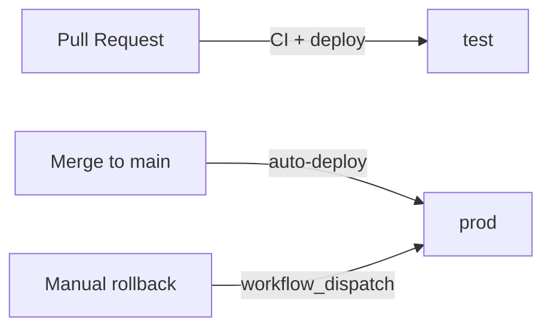

# Contributing

This repository follows **trunk-based development**. All changes go through pull requests targeting `main`.

## Checklist

- [ ] PR title follows [Conventional Commits](https://www.conventionalcommits.org/en/v1.0.0/) (e.g. `feat: ...`, `fix: ...`)
- [ ] Code builds without errors
- [ ] Formatting passes (`dotnet format --verify-no-changes`)
- [ ] Changes have been verified in the **test** environment (deployed on PR)

## Deployment flow

